# Transformateur UML (plateforme GenMyModel) vers le langage gaml (plateforme Gama)

Le transformateur permet de convertir une modélisation UML réalisée au travers de l'outil [GenMyModel](https://www.genmymodel.com/) d'[Axellience](https://www.axellience.com/) vers du code gaml exécutable au travers de la plateforme [Gama](https://gama-platform.github.io/).

## Installation

Le script python transformateur.py nécessite une version supérieure ou égale à la 3.6 et les dépendances suivantes:

* Beautiful Soup (bs4) avec le parser xml
* Jinja2

```
pip install -r requirements.txt
```

## Modélisation sous GenMyModel

Le cas d'utilisation [proies/prédateurs](https://gama-platform.github.io/wiki/PredatorPrey) proposé par la plateforme Gama sera notre projet référent afin de comprendre le fonctionnement et les possibilités offertes par le transformateur.

### Spécificité du langage gaml

Prenons le code gaml de la [première étape](https://gama-platform.github.io/wiki/PredatorPrey_step1) détaillée pour l'exemple proies/prédateurs et tachons d'en extraire les principales parties.

```
model prey_predator

global {
    int nb_preys_init <- 200;
    init {
        create prey number: nb_preys_init ;
    }
}

species prey {
    float size <- 1.0 ;
    rgb color <- #blue;
        
    aspect base {
        draw circle(size) color: color ;
    }
} 

experiment prey_predator type: gui {
    parameter "Initial number of preys: " var: nb_preys_init min: 1 max: 1000 category: "Prey" ;
    output {
        display main_display {
            species prey aspect: base ;
        }
    }
}
```

Décrivons les différentes sections:
* <b>global</b>: ce bloc d'instruction permet de déclarer et d'instancier des variables globales au programme. Au sein de ce bloc, nous avons la fonction <b>init</b> permettant d'instancier nos agents (dans cet exemple 200 proies vont être créées lors de la simulation).
* <b>déclaration des <i>species</i></b>: cette partie décrit les caractéristiques de nos agents (variables, fonctions, etc.).
* <b>experiment</b>: ce bloc permet d'instancier une nouvelle expérience au sein de Gama.

A noter que le langage gaml inclut, au travers des <i><b>facets</b></i>, la possibilité de paramétrer la déclaration d'une variable, d'une fonction ou bien d'une <i>species</i>. Dans l'exemple ci-dessous <i>number</i> est une <i>facet</i> de la fonction <i>create</i>.

```
create prey number: nb_preys_init ;
```

### Création d'un diagramme de classes sous GenMyModel

Maintenant que nous avons pris connaissance de ces différentes parties, transcrivons les au sein de la plateforme GenMyModel. Créer un <b>nouveau diagramme de classes</b> et créer 4 packages avec les noms suivants:
* <b>global</b>: ce package contient la déclaration de nos variables et fonctions globales.
* <b>instanciation</b>: ce package permet d'instancier nos agents lors de la simulation (fonction <i>init</i> du bloc <i>global</i>).
* <b>meta_model</b>: ce package contient la déclaration de nos <i>species</i>.
* <b>experiment</b>: ce package instancie le bloc <i>experiment</i>.

<div style="width: 100%; text-align:center">
    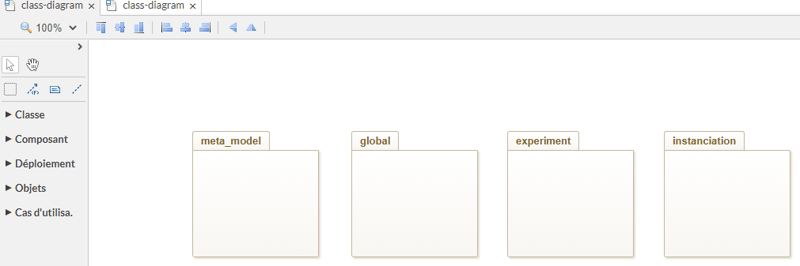
    <p><i>Diagramme de classes général.</i></p>
</div>

Détaillons, désormais, les différents packages et leurs spécificités afin de considérer les spécificités du langage gaml. Débutons par le package <b>global</b>.

Le <u>package <b>global</b></u> contient un diagramme de classes dans lequel nous devons créer une classe <i>global</i>.

<div style="width: 100%; text-align:center">
    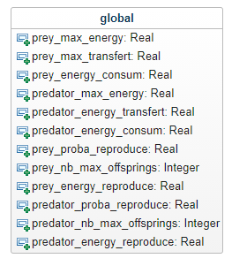
    <p><i>Classe global de l'exemple complet proies/prédateurs.</i></p>
</div>

Dans cet exemple, la classe contient l'ensemble des variables globales et leurs valeurs par défaut. Ces dernières sont renseignées à l'aide de la section <i>Default Value</i> de l'onglet Propriétés. 

<div style="width: 100%; text-align:center">
    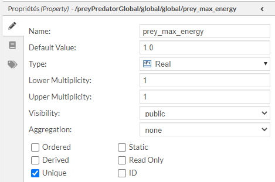
    <p><i>Section Propriété afin de définir une valeur par défaut à la variable.</i></p>
</div>

Cette section permet également de préciser la cardinalité des variables. Si la variable est un tableau d'entiers (<i>list&lt;int></i>), par exemple, alors <i>Lower Multiplicity</i> est égal à 0 et <i>Upper Multiplicity</i> à <b>*</b>.

Le <u>package <b>instanciation</b></u> contient un diagramme d'objets dans lequel nous déclarons et instancions nos agents. Le transformateur boucle sur l'ensemble des objets déclarés au sein de ce diagramme d'objets pour créer les agents.

<div style="width: 100%; text-align:center">
    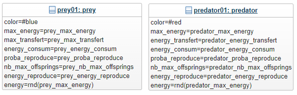
    <p><i>Instanciation de deux agents, un prey et un predator. Les attributs de ces agents sont instanciés avec des variables globales (ou des valeurs brutes comme #blue).</i></p>
</div>

Dans cet exemple, nous instancions seulement deux agents.

Pour ajouter des <i>facets</i> à la fonction <i>create</i>, il est possible d'ajouter des <i>Custom Properties</i> à l'objet.

<div style="width: 100%; text-align:center">
    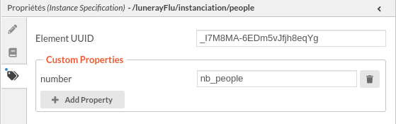
    <p><i>Cette Custom Properties permet de générer le code suivant: create people number: nb_people {...}.</i></p>
</div>

Si l'<b>ordre d'instanciation</b> des agents est important, vous pouvez ajouter une <i>Custom Properties</i> aux différentes instances avec la clé <b><i>priority</i></b> et la valeur associée à l'ordre de priorité (1,2,3, etc.).

<div style="width: 100%; text-align:center">
    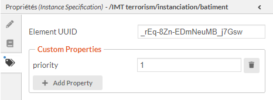
    <p><i>Définition de l'ordre de priorité d'initialisation des agents.</i></p>
</div>

<i>NB</i>: Cette <i>Custom Properties</i> est réservée, elle n'apparaît pas en tant que <i>facet</i> dans le code gaml.

Le <u>package <b>meta_model</b></u> contient un diagramme de classes permettant de représenter toutes nos <i>species</i> et leurs comportements.

<div style="width: 100%; text-align:center">
    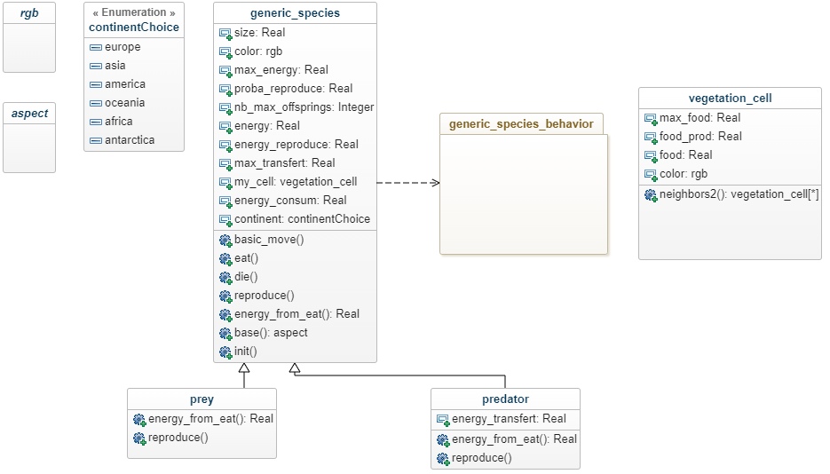
    <p><i>Diagramme de classes de l'exemple proies/prédateurs.</i></p>
</div>

Détaillons les spécificités de ce diagramme.
* Les <b>classes abstraites</b> <i>rgb</i> et <i>aspect</i>. Ces classes sont ignorées par le transformateur. Elles permettent notamment d'utiliser certains types natifs à Gama au sein de la modélisation. Par exemple, le type <i>rgb</i> permet de déclarer une couleur et <i>aspect</i> indique le type de retour de la fonction <i>base()</i> de <i>generic_species</i>. Une même classe abstraite peut être créée dans plusieurs packages (e.g. la classe <i>rgb</i> dans <i>global</i> et <i>metal_model</i> pour déclarer une couleur).
* La relation d'héritage (<i>species prey parent: generic_species {}</i>) est symbolisé par un lien d'héritage entre la classe mère et la classe fille.
* Les opérations. Une opération sans type de retour sera considérée comme une <i>action</i> au sein de Gama. Si l'utilisateur veut indiquer une <i>reflex</i> alors il doit déclarer une classe abstraite <i>reflex</i> et l'indiquer en type de retour.
* A l'instar du package *instanciation*, pour inclure une <i>facet</i> lors de la création de la *species*, il faut se rendre dans la section Propriété et ajouter des *Custom Properties*.

Pour modifier le mot-clé *species*, vous pouvez utiliser la *Custom Properties* <b>object_type</b>. L'exemple ci-dessous permet de déclarer une grille.

<div style="width: 100%; text-align:center">
    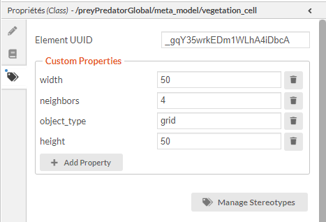
    <p><i>Déclaration des facets pour la classe vegetation_cell.</i></p>
</div>

<i>NB</i>: Cette <i>Custom Properties</i> est réservée, elle n'apparaît pas en tant que <i>facet</i> dans le code gaml.

* Les comportements. Au sein du diagramme de classes du package <i>meta_model</i>, nous y retrouvons un package nommé <i>generic_species_behavior</i> (ce dernier doit avoir la <i>Custom Properties: behavior</i> sans valeur spécifique). Ce package contient un diagramme d'état permettant d'inclure un comportement à une *species* sous la forme d'un diagramme d'état. Un lien de dépendance permet d'indiquer la classe qui bénéficie de ce comportement (une seule connexion possible). Lorsqu'une dépendance est réalisée la *species* inclut automatiquement la *facet* *control: fsm*.

<div style="width: 100%; text-align:center">
    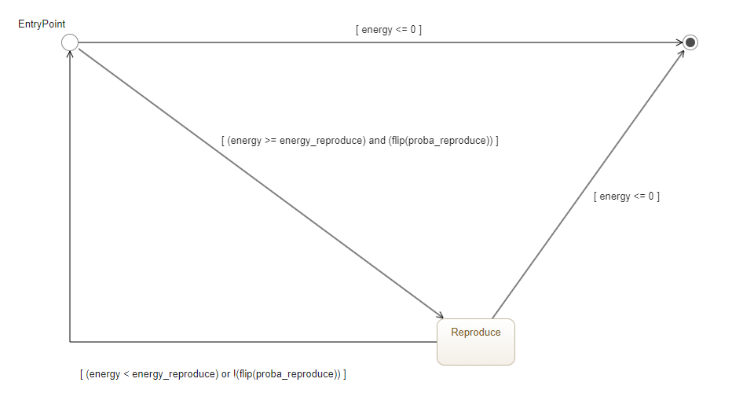
    <p><i>Déclaration des facets pour la classe vegetation_cell.</i></p>
</div>

Au sein de ce diagramme nous retrouvons un état initial, un état final et l'état <i>Reproduce</i> ainsi que les différentes transitions (et leur valeur) entre ces états. Le diagramme doit contenir un <i>EntryPoint</i> et un <i>FinalPoint</i> afin d'indiquer aux transformateur l'état initial et final du FSM. Ce diagramme est transformé de la manière suivante:

```
state EntryPoint initial: true {
    do basic_move();
    do eat();
    transition to: Reproduce when: (energy >= energy_reproduce) and (flip(proba_reproduce));
    transition to: FinalPoint when: energy <= 0;
}
state Reproduce {
    do reproduce();
    transition to: EntryPoint when: (energy < energy_reproduce) or !(flip(proba_reproduce));
    transition to: FinalPoint when: energy <= 0;
}
state FinalPoint final: true {
    do die();
}
```

Pour préciser les fonctions à exécuter lors des états, nous devons indiquer des <i>Custom Properties</i> au sein des états. Ces <i>Custom Properties</i> peuvent également être définies au sein des transitions si une action doit être effectuée lors d'une transition.

<div style="width: 100%; text-align:center">
    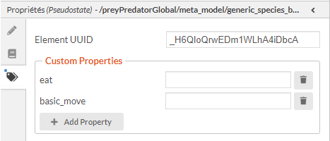
    <p><i>Déclaration des actions a effectuer au sein de l'état initial EntryPoint.</i></p>
</div>

Les fonctions <i>basic_move()</i>, <i>eat()</i>, etc. doivent être présentes sous la forme d'opération au sein de la classe bénéficiant de ce comportement.

Le <u>package <b>experiment</b></u> contient un diagramme de classes permettant d'instancier une expérience au sein du fichier gaml. Au sein de ce diagramme, les classes définissent les expériences où le nom de la classe correspond au nom de l'expérience.

<div style="width: 100%; text-align:center">
    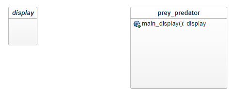
    <p><i>Diagramme de classe pour instancier le bloc experiment.</i></p>
</div>

Nous pouvons observer la classe abstraire <i>display</i> permettant d'indiquer un type de retour à l'opération <i>main_display</i>.

### Contenu des opérations à l'aide d'un fichier JSON

Un fichier <i>.json</i> est nécessaire si l'utilisateur désire renseigner le contenu des opérations de ces classes. Ce fichier doit représenter l'ensemble des classes et leurs opérations. Le fichier pour l'exemple proies/prédateurs est disponible dans le dossier <i>data/gama/</i>. Ce fichier est nécessaire mais si les opérations ne sont pas complétées alors le transformateur fournira uniquement le squelette du code gaml.

## Utilisation

L'option <i>-f</i> permet d'indiquer le nom du fichier json (au sein du répertoire <i>data/gama/</i>) et du fichier <i>xmi</i> (au sein du répertoire <i>data/models/</i>). Le nom doit être le même.

```
python transformateur.py -f preyPredator
```

Le code généré est déposé au sein du répertoire <i>outputs/</i>.